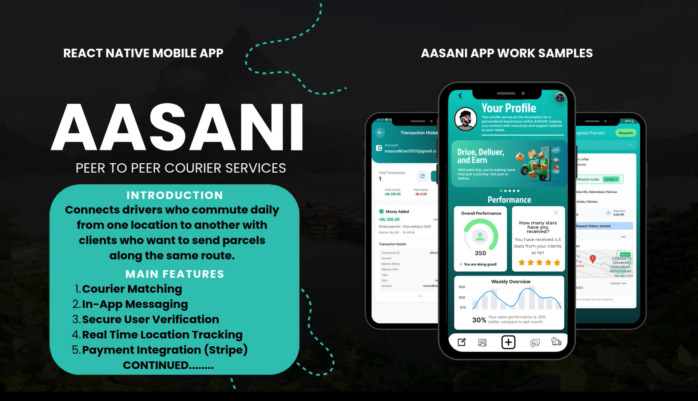

# AASANI - Peer-to-Peer Delivery Service

> 

## 📱 Overview

AASANI is a peer-to-peer delivery service application that connects travelers who regularly commute between cities with clients needing items delivered. By leveraging existing travel routes, AASANI reduces delivery costs and time, especially in underserved areas of Pakistan where traditional courier services are expensive, slow, or unavailable.

> Transforming package delivery through community connections

## 🎯 Problem Addressed

In places like Nowshera, Pakistan, sending packages is challenging:
- Traditional courier services (TCS, Leopard) are expensive
- Delivery to smaller towns is often unreliable
- Long waiting times for important items
- No platform for regular travelers to help with deliveries

## ✨ Key Features

- **Role-Based System**: Register as a client or traveler
- **Smart Matching**: Algorithm connects clients with nearby travelers
- **Real-Time Tracking**: GPS-based delivery tracking
- **In-App Chat**: Direct communication between clients and travelers
- **Rating System**: Build trust through user reviews
- **Complaint Handling**: Structured system for issue resolution
- **Payment Integration**: Secure transaction processing
- **Admin Panel**: Comprehensive management dashboard

## 🛠️ Tech Stack

| Component | Technology |
|-----------|------------|
| Mobile App | React Native |
| Admin Panel | React, Tailwind CSS |
| Backend | Node.js, Firebase |
| Database | Firebase Realtime Database |
| Authentication | Firebase Auth |
| Maps & Location | Google Maps API |
| Notifications | Firebase Cloud Messaging |
| Testing | Jest |

## 📱 Mobile App Screenshots

  <table>
    <tr>
      <td align="center">
        
         
        <em>Home Screen</em>
      </td>
      <td align="center">
        
         
        <em>Login Screen</em>
      </td>
    </tr>
    <tr>
      <td align="center">
        
         
        <em>Register Form Phase 1</em>
      </td>
      <td align="center">
        
         
        <em>Notifications Interface</em>
      </td>
    </tr>
    <tr>
      <td align="center">
        
         
        <em>Post Info Live Tracking</em>
      </td>
      <td align="center">
        
         
        <em>Stripe Payment Screen</em>
      </td>
    </tr>
  </table>

## 💻 Admin Panel Screenshots

  <table>
    <tr>
      <td align="center">
        
         
        <em>Web Public Website</em>
      </td>
    </tr>
    <tr>
      <td align="center">
        
         
        <em>Admin Management</em>
      </td>
    </tr>
  </table>

## 🏗️ Architecture

AASANI follows a three-tier architecture:
- **Frontend**: React Native mobile app for clients/travelers + React web admin panel
- **Backend**: Node.js server with Firebase integration
- **Database**: Firebase Realtime Database for data storage and synchronization

The system uses Firebase Authentication for user management and Google Maps API for location services and delivery tracking.

## 🚀 Getting Started

### Prerequisites

- Node.js (v14 or higher)
- npm or yarn
- React Native development environment
- Firebase account
